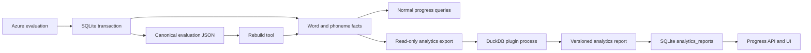

# Focused Practice and Learning Analytics Plan

Prepared: 19 September 2026. Scope: focused sentence drills, progress analytics, an optional
DuckDB analytics plugin, and a database evolution path. This document is an implementation
plan; none of these features are implemented by this document.

## 1. Decisions

1. Keep SQLite as ClearSpeak's transactional source of truth while the app runs as one Node
   service on one durable host.
2. Add normalized, rebuildable word and phoneme observation tables to support normal product
   queries. Do not require DuckDB for ordinary history or progress pages.
3. Add DuckDB as an optional, read-only analytics plugin. It will analyze selected facts in a
   separate process and return a versioned report; it will never own attempts, evaluations, or
   recordings.
4. Keep saved Azure evaluation JSON as the canonical assessment result. Derived analytics facts
   and current analytics reports must be reproducible from surviving canonical history.
5. Defer PostgreSQL until accounts, multiple application instances, managed high availability,
   or demonstrated SQLite write contention make it necessary.
6. Do not add Docker Compose merely to anticipate PostgreSQL. If PostgreSQL is later adopted,
   use Compose for local development and CI, and prefer managed PostgreSQL in production.

DuckDB is an analytics engine, not the component that decides how to coach the learner. Fixed,
reviewed TypeScript rules will translate query evidence into careful recommendations.

## 2. Product goal

Turn the existing assessment flow into a repeatable learning loop:

**Record a passage → identify one evidenced weakness → practise its sentence → retry → compare → review progress later.**

The learner should be able to answer:

- What should I practise next?
- Which sounds or delivery skills recur across different attempts?
- Am I improving on comparable material?
- Which passage or sentence should I use for the next drill?
- Is there enough evidence for the app's conclusion?

The app must not claim that an Azure score proves proficiency, intelligibility, or a diagnosis.

## 3. Current foundation

The repository already provides most of the required foundation:

- 44 reviewed passages with stable identities, focus tags, and sentence chunks.
- Browser recording and Azure phoneme-level assessment.
- Server-backed SQLite history with complete evaluation JSON and normalized headline scores.
- Offline pending-save recovery, exact-text repeat, and compatible previous-attempt comparison.
- A deterministic weakest-metric and weak-phoneme presentation.

The main gaps are:

- Attempt scope supports only a complete passage even though chunk boundaries already exist.
- Phoneme and word observations are stored only inside evaluation JSON, making recurring-pattern
  queries unnecessarily expensive and awkward.
- History is an archive rather than a progress view.
- Current coaching identifies a weak item but rarely provides a concrete drill.
- Comparison displays score deltas but makes previous/current audio comparison cumbersome.

## 4. Target user experience

### 4.1 Results: one primary action

After a successful full-passage assessment:

1. Select one primary target using the evidence rules in section 8.
2. Show the target word, containing sentence, and a short reviewed instruction.
3. Offer **Practice this sentence** as the main action.
4. Keep detailed IPA, words, and scores available below the primary action.
5. Offer **This feedback seems wrong** so questionable provider results can be excluded from
   recommendations without deleting the attempt.

### 4.2 Focused drill

- Preload the exact authored chunk containing the target word.
- For custom text, derive a stable sentence chunk from normalized sentence boundaries.
- Clearly label the recording as a sentence drill rather than a full-passage attempt.
- Permit two or three retries without forcing the learner back through the library.
- Compare only attempts with the same exact chunk, locale, assessment settings, and compatible
  evaluation schema.
- After the drill, offer **Try the full passage again**.

### 4.3 Progress

Add a Progress page with:

- Practice days and completed attempts for the selected time range.
- First/latest results for the same passage or chunk; never average unrelated texts into a
  supposed proficiency score.
- Recurring sound targets, evidence count, representative words, and latest practice date.
- Trends for accuracy, fluency, completeness, and prosody only across compatible observations.
- A **What to work on next** list containing at most three recommendations.
- An honest insufficient-data state rather than conclusions from one low score.

### 4.4 Next practice

Replace the current latest-attempt-only recommendation with a ranked choice:

1. A due or recently weak target with enough evidence.
2. A passage containing the target focus and not recently practised.
3. An unpractised passage at the learner's selected band.
4. The most recent compatible passage as a fallback.

The user can always ignore the recommendation and choose any text.

## 5. Architecture



Rules:

- The recording BLOB is never exported to DuckDB.
- DuckDB never attaches to or writes to the live SQLite database.
- A plugin failure never blocks recording, assessment, saving, history, or basic progress.
- The normal request path reads SQLite. DuckDB runs outside the user request that saved an
  attempt.
- Analytics reports are caches and may be deleted and rebuilt.

## 6. SQLite schema evolution

Use normal versioned migrations. Back up and restore-test the database before production rollout.

### 6.1 Attempt context

Extend the attempt model with:

| Field | Purpose |
|---|---|
| `scope` | `passage` or `chunk` |
| `practice_session_id` | Groups the initial passage, sentence retries, and final passage retry |
| `chunk_id` | Stable authored chunk ID or deterministic custom-text chunk hash |
| `parent_reference_text` | Exact parent passage snapshot for returning to the full passage |
| `target_kind` | Optional `phoneme`, `ending`, `accuracy`, `fluency`, `completeness`, or `prosody` |
| `target_key` | Optional symbol or metric key selected for this drill |

Preserve the existing library/custom source identity. A library chunk keeps the parent passage ID
and version while its `reference_text` stores the exact assessed chunk.

`practice_session_id` is initially a nullable immutable UUID, not a foreign key to a new session
table. Starting a full-passage recording creates it; sentence retries and the final full-passage
retry reuse it. Opening an old attempt through **Record again** starts a new session. Legacy
attempts remain null. Add a first-class session table only when sessions need their own mutable
metadata.

### 6.2 Word observations

Add a derived `word_observations` table:

| Field | Notes |
|---|---|
| `attempt_id` | Foreign key with cascade delete |
| `word_index` | Stable ordinal within the parsed result |
| `word` | Exact assessed word text |
| `accuracy_score` | Nullable bounded score |
| `error_type` | Provider error type after validation |
| `is_omitted` | Explicit omission only; never inferred from a low score |

Primary key: `(attempt_id, word_index)`.

### 6.3 Phoneme observations

Add a derived `phoneme_observations` table:

| Field | Notes |
|---|---|
| `attempt_id`, `word_index`, `phoneme_index` | Composite identity |
| `word`, `symbol`, `position` | Validated display and grouping fields |
| `accuracy_score` | Nullable bounded score |
| `alternative_symbol`, `alternative_confidence` | Best non-identical N-best alternative when present |
| `word_omitted` | Prevents an omitted word from becoming a phoneme diagnosis |
| `derivation_version` | Supports a safe rebuild when parsing rules change |

Indexes should support `(symbol, accuracy_score)`, `attempt_id`, and recent-attempt joins. Do not
store coaching prose in this table.

### 6.4 Learner feedback and analytics reports

Add:

- `assessment_feedback(attempt_id, observation_key, observation_kind, metric_key, word_index,
  phoneme_index, verdict, created_at, updated_at)` where `observation_key` is a validated stable
  locator such as `metric:accuracy`, `word:3`, or `phoneme:3:1`. Use
  `(attempt_id, observation_key)` as the primary key so saving feedback is an idempotent upsert.
  The server must verify that the locator exists in the canonical saved evaluation. A grouped sound
  card saves feedback for its exact contributing observations; rejecting one `/t/` must not reject
  every `/t/` in the attempt.
- `analytics_reports(id, input_change_seq, dataset_digest, engine, engine_version, sql_version,
  rules_version, tips_version, content_catalog_version, generated_at, window_start, window_end,
  coverage_json, report_json)`.
- One `analytics_control` row, enforced by a singleton primary key/check, containing `change_seq`,
  `minimum_valid_seq`, `requested_seq`, `completed_seq`, `requested_at`, `job_status`,
  `lease_token`, `lease_expires_at`, `attempt_count`, and `last_error`. `job_status` is one of
  `idle`, `pending`, `running`, or `failed`.

`change_seq` is a global monotonic integer, separate from each attempt's optimistic-lock revision.
Increment it in the same transaction that creates analytics facts, changes learner feedback, or
deletes an attempt. An export reads `change_seq` and all selected facts inside one consistent read
transaction and uses that value as `input_change_seq`.

New attempts may leave the previous report visible with an explicit stale label. Feedback changes
and deletions set `minimum_valid_seq` to the new `change_seq`; reports below that sequence must not
be served. Attempt deletion also deletes cached report payloads in the same transaction because a
report may contain words copied from the deleted attempt. A report produced by work that started
before that deletion is rejected when `input_change_seq < minimum_valid_seq`.

When storing a completed report, never replace a report with a higher `input_change_seq`. Update
`completed_seq` monotonically. If `requested_seq` advanced during the run, leave the job pending so
the worker runs again. Retain the latest ten valid reports for diagnostics and delete older payloads.
Reports are rebuildable caches; deleting them must not remove source history.

### 6.5 Backfill

Create an idempotent command that:

1. Reads successful saved evaluation JSON in bounded batches.
2. Validates it through the current history validator.
3. Recreates word and phoneme facts transactionally per attempt.
4. Records its derivation version and progress.
5. Can resume after interruption and produces counts for verification.

The migration creates `analytics_control` at sequence zero. After the initial fact backfill commits,
advance `change_seq`, `minimum_valid_seq`, and `requested_seq` together once and mark the first
analytics refresh pending; do not increment the global sequence once per historical observation.

## 7. Analytics plugin contract

Create an internal server-only interface similar to:

```ts
type AnalyticsDatasetManifest = {
  version: 1;
  inputChangeSeq: number;
  datasetDigest: string;
  generatedAt: string;
  timeZone: string;
  truncated: boolean;
  versions: {
    evaluationSchema: number;
    derivation: number;
    sql: number;
    rules: number;
    tips: number;
    contentCatalog: string;
  };
  rowCounts: {
    attempts: number;
    words: number;
    phonemes: number;
    feedback: number;
  };
  files: {
    attempts: string;
    words: string;
    phonemes: string;
    feedback: string;
  };
};

type AnalyticsReport = {
  version: 1;
  inputChangeSeq: number;
  datasetDigest: string;
  engine: "duckdb";
  engineVersion: string;
  sqlVersion: number;
  rulesVersion: number;
  tipsVersion: number;
  contentCatalogVersion: string;
  generatedAt: string;
  coverage: AnalyticsCoverage;
  overview: AnalyticsOverview;
  weaknesses: WeaknessInsight[];
  improvements: ImprovementInsight[];
  recommendations: PracticeRecommendation[];
};

interface LearningAnalyticsPlugin {
  readonly id: "duckdb";
  analyze(manifest: AnalyticsDatasetManifest): Promise<AnalyticsReport>;
}
```

The manifest paths are generated internally beneath one private temporary work directory and are
never accepted from an HTTP request. The contract must contain no database connection, SQLite row,
DuckDB value object, or UI-specific class. This keeps it testable and portable to PostgreSQL later.

## 8. Evidence and recommendation rules

### 8.1 Eligible evidence

Include only:

- Successful evaluations with compatible parser/evaluation versions.
- Finite validated scores.
- Attempts not cut off by the 30-second limit for like-for-like progress comparisons.
- Explicitly spoken words for phoneme analysis.
- Matching locale for any grouped sound trend.

Keep passage and chunk attempts separate unless a query explicitly compares the same phoneme
across scopes. Exclude targets marked **This feedback seems wrong** from recommendation ranking,
while retaining them in history.

### 8.2 Recurring weakness

Do not label a recurring weakness until there are at least:

- Three eligible observations,
- Across two distinct practice sessions,
- Across two distinct words for a phoneme target.

Aggregate repeated instances into at most one contribution per symbol per attempt before ranking,
so a passage that happens to contain many copies of one sound cannot dominate the evidence. Chunk
retries from one practice session may strengthen comparison within that session, but cannot by
themselves establish a cross-session recurring weakness.

Report the median score, low-score count, observation count, distinct-attempt and distinct-session
counts, representative words, and last-practised date. Use careful language such as “often scored
lower” rather than “you cannot pronounce.”

Use a documented deterministic rank, for example:

```text
priority = severity × evidence × recency

severity = clamp((60 - median_score) / 60, 0, 1)
evidence = min(1, distinct_sessions / 5)
recency = 1 for recent evidence, decaying to a documented floor
```

Tune thresholds only after examining real saved attempts. Version every rule change.

### 8.3 Improvement

- For a passage or chunk, compare first and latest compatible attempts and show the best attempt as
  supporting context.
- For recurring sounds, use rolling medians rather than a single before/after score.
- Require enough observations in both earlier and later windows.
- Describe small or noisy changes as stable/uncertain rather than improved or declined.
- Never combine different locales, prosody settings, parser versions, or scopes into one trend.

### 8.4 Recommendations

Generate at most three recommendations. Every recommendation must include:

- A target and plain-language label.
- The evidence supporting it.
- A reviewed instruction from a sound-tip or metric-tip catalog.
- One suggested chunk or passage already available in ClearSpeak.
- A reason the suggested material matches the target.

DuckDB selects and aggregates evidence. TypeScript maps evidence to reviewed coaching and practice
content. No generative model is required.

## 9. DuckDB plugin design

### 9.1 Runtime

- Use the current `@duckdb/node-api` (Node Neo) client, pinned to an exact tested version.
- Run the plugin in a separate Node process with bounded memory, threads, runtime, and output size.
- Build the versioned dataset from selected SQLite metadata/fact tables inside one bounded,
  consistent read transaction. Stream rows in batches to atomically written, mode-`0600` NDJSON
  files beneath a server-created temporary directory. Do not construct one all-history JavaScript
  object or transfer the complete dataset through stdin.
- Initial hard limits are 10,000 attempts, 500,000 word observations, 2,000,000 phoneme
  observations, and 512 MiB of total export files. If history exceeds a limit, select the newest
  complete practice sessions that fit, set `truncated: true`, and expose the covered date range.
  Revisit these limits using measured runtime and memory rather than silently raising them.
- Compute SHA-256 over a canonical logical metadata block plus the dataset files in a documented
  order. Omit `datasetDigest`, `generatedAt`, and physical temporary paths from the hash; use fixed
  logical file names so identical data and versions produce the same digest on separate runs.
  Store the resulting digest in both manifest and report.
- Start with an in-memory DuckDB database rebuilt per analysis run; the dataset is small and the
  output report is persisted separately.
- Parse the NDJSON incrementally and bulk-load normalized rows using the DuckDB appender or an
  equivalent parameterized API.
- Run fixed, source-controlled SQL. Never expose an arbitrary SQL endpoint or interpolate user
  input into SQL.
- Do not load community extensions. No DuckDB extension is required for the initial design.

This avoids attaching the live SQLite file, avoids copying audio, and avoids linking DuckDB's
SQLite extension into the web process. DuckDB's official SQLite extension remains useful for
manual analysis of an isolated snapshot, but it is not part of the application path.

### 9.2 Scheduling

Initial policy:

- Every relevant transaction advances `change_seq`, advances `requested_seq`, and durably marks a
  refresh pending. If a job is already running, it finishes against its captured sequence and the
  newer request remains pending.
- Refresh at most once every 15 minutes through a systemd timer or explicit maintenance command.
- The worker claims the singleton job transactionally with a random lease token and expiry. A
  second worker cannot claim a live lease; an expired lease is recoverable after a crash.
- Allow an authenticated **Refresh insights** action that sets the durable requested sequence to
  the current `change_seq` and updates its timestamp. It never spawns an untracked process and does
  not hold the HTTP request open for analysis.
- Continue showing the last successful report with its generation time while a refresh is pending.
- Serve a report only when `input_change_seq >= minimum_valid_seq`. Additions may display an older
  report as stale; feedback changes and deletions hide invalid reports until a replacement exists.
- Fall back to basic SQLite summaries when no DuckDB report exists.

Do not rely on an in-process fire-and-forget promise surviving a deployment or restart.

### 9.3 Failure isolation

- Time out and terminate a stuck analytics process.
- Validate the returned report against a strict schema before saving it.
- Delete temporary dataset files after success, failure, timeout, or startup recovery.
- Reject a result whose input sequence, digest, engine version, or declared row counts do not match
  its job manifest.
- Retain the last valid report after failures only when it still satisfies `minimum_valid_seq`.
- Show “Insights last updated …” and a non-blocking error if refresh fails.
- Log run metadata and sanitized errors, never assessment text or access credentials by default.

## 10. API and UI

Proposed authenticated endpoints:

| Endpoint | Purpose |
|---|---|
| `GET /api/progress` | Basic SQLite overview and latest valid advanced report |
| `POST /api/progress/refresh` | Schedule an analytics refresh with rate limiting |
| `PUT /api/attempts/[id]/feedback` | Save or clear `seems-wrong` feedback |

Proposed pages/components:

- `/progress`: overview, recurring targets, compatible trends, recommendations, data sufficiency,
  and report freshness.
- Results focus card: reviewed drill plus **Practice this sentence**.
- Focused recording session: chunk label, target, retry count, and **Return to full passage**.
- Comparison: adjacent previous/current audio controls and compatible metric deltas.
- Home continuation card: recommended next practice with an explanation and manual alternatives.

All charts must have a text/table equivalent and must not rely on color alone.

Use a configured IANA timezone, `CLEARSPEAK_TIME_ZONE`, for practice-day groupings and review due
dates; default to `UTC` and display the active timezone. A future account system can replace this
with a per-user setting without changing stored UTC timestamps.

## 11. PostgreSQL and Docker evolution

### 11.1 Stay on SQLite while

- There is one application process and one durable host.
- The app is personal or shared through one access code rather than user accounts.
- Writes remain short and `SQLITE_BUSY` is not a measurable problem.
- Backup/restore objectives are met by consistent snapshots copied off-host.

### 11.2 Migrate to PostgreSQL when

- User accounts and tenant isolation are scheduled.
- More than one application replica must write concurrently.
- The app moves to ephemeral/serverless compute.
- Managed point-in-time recovery, failover, or external concurrent access is required.
- Production evidence shows SQLite contention or operational limits.

### 11.3 Prepare without premature dual support

- Keep route handlers calling repository functions rather than database clients.
- Keep analytics input/output contracts database-neutral.
- Use versioned migrations and explicit domain types.
- Avoid exposing SQLite row shapes outside server persistence modules.
- Keep recordings behind an audio repository boundary so a scaled deployment can move audio to
  object storage while PostgreSQL stores metadata and evaluations.
- Do not introduce an ORM or maintain SQLite and PostgreSQL implementations simultaneously before
  the migration is approved.

The analytics manifest, fact schema, and report schema remain stable during a PostgreSQL migration;
only the extractor/repository implementation changes.

When PostgreSQL is selected, provide Docker Compose for local development and CI only. Pin the
major version, use a named volume, add health checks, and test dump/restore and major-version
upgrade procedures. Prefer a managed PostgreSQL service in production; Compose on one host does
not provide database high availability or managed backups.

## 12. Delivery sequence

### Milestone 1 — Focused drill data model

- Add attempt scope, session, chunk, and target fields.
- Extend validation, persistence, compatibility rules, and history rendering.
- Implement authored/custom chunk selection and **Practice this sentence**.
- Keep full-passage and chunk comparisons separate.

Completion: a learner can move from a weak word to its sentence, record multiple compatible
sentence attempts, compare them, and return to the original passage.

### Milestone 2 — Reviewed coaching and analytics facts

- Add the reviewed sound/metric tip catalog.
- Add word and phoneme observation tables.
- Populate them transactionally for new evaluations.
- Add resumable backfill and rebuild commands.
- Add the global analytics sequence, invalidation rules, and durable refresh-control row.
- Add **This feedback seems wrong**.

Completion: derived facts exactly match the canonical evaluation fixtures and can be fully rebuilt.

### Milestone 3 — Basic SQLite progress

- Implement practice counts, compatible passage/chunk trends, recurring-target queries, and data
  sufficiency states.
- Add `/progress` with no DuckDB dependency.
- Improve previous/current audio comparison.

Completion: progress remains useful when the DuckDB plugin is disabled or unavailable.

### Milestone 4 — DuckDB analytics plugin

- Add the versioned plugin contract and dataset extractor.
- Integrate the pinned Node Neo client in a separate bounded process.
- Implement fixed aggregation queries and deterministic recommendation mapping.
- Persist validated reports and expose freshness/failure state.
- Add the timer/maintenance command and deployment documentation.

Completion: disabling, crashing, or deleting DuckDB analytics state does not affect recordings,
history, or basic progress; the report can be regenerated from SQLite.

### Milestone 5 — Adaptive next practice and pilot

- Rank due/weak/unpractised practice choices.
- Add recommendation explanations and manual override.
- Pilot for at least two weeks before tuning thresholds.
- Review false positives, insufficient-data frequency, repeated drill completion, and whether
  learners can hear improvement beyond score changes.

Completion: recommendations are evidence-backed, reproducible, and useful in real sessions.

## 13. Testing and verification

### Unit tests

- Evaluation-to-word/phoneme fact extraction, including omissions and absent scores.
- Chunk identity and exact-text preservation.
- Compatibility rules across locale, settings, parser version, source version, and scope.
- Weakness ranking, minimum evidence, recency, rolling medians, and insufficient-data behavior.
- Recommendation mapping and `seems-wrong` exclusions.
- Analytics report schema validation and version rejection.

### Repository and migration tests

- Upgrade an existing version-1 history database without losing recordings or evaluations.
- Idempotent fact backfill and interrupted-resume behavior.
- Cascade deletion of derived facts and feedback.
- Rebuild facts from canonical JSON and obtain identical rows.
- Preserve existing upload/evaluation idempotency and tombstone behavior.

### DuckDB plugin tests

- Golden datasets produce stable versioned reports.
- Empty, tiny, malformed, and large bounded datasets are handled safely.
- No recording bytes or secrets appear in the exported dataset or report.
- Timeout, crash, invalid JSON, excessive output, and stale revision preserve the last valid report.
- Deletion during an analytics run rejects the older report and exposes no deleted text.
- Concurrent refresh requests coalesce durably and lease expiry recovers a crashed worker.
- SQLite-only progress works with the package disabled.

### Component and end-to-end tests

- Full passage → focused sentence → retries → full passage round trip.
- Progress page accessible names, keyboard use, text alternatives, loading, stale, and error states.
- Adjacent audio comparison does not play both recordings simultaneously.
- Recommendation links preload the exact intended text and identity.
- Mobile layouts remain usable without reference speech playback.

Run lint, typecheck, the complete Vitest suite, and a production build for every milestone. Manually
verify real microphone and saved-audio playback on desktop and iPhone; browser speech synthesis is
not a prerequisite for focused drills or analytics.

## 14. Operational and privacy requirements

- Analytics contains assessment text and pronunciation observations, so protect all progress
  endpoints with the same access policy as history.
- Do not copy WAV BLOBs, Azure tokens, access codes, or raw credentials into analytics datasets.
- Keep analytics files under `CLEARSPEAK_DATA_DIR` with restrictive permissions.
- Include analytics reports in documented backups only if desired; they are rebuildable and not a
  substitute for backing up SQLite history.
- Bound exported rows, memory, threads, execution time, and report size.
- Pin DuckDB and its Node binding. Review upgrades separately from application releases.
- Do not allow user-supplied SQL, database paths, extension repositories, or output paths.

## 15. Likely implementation map

| Area | Likely work |
|---|---|
| Shared contracts | Extend `lib/history/types.ts`; add analytics dataset/report types and validators |
| SQLite migrations | Extend `lib/server/history-db.ts` and repository methods |
| Fact extraction | Add a pure evaluation-to-observations module plus rebuild command |
| Focused drills | Extend `components/clearspeak-app.tsx`, results, recording, history, and comparison |
| Reviewed tips | Add a versioned sound/metric tip catalog |
| Basic analytics | Add SQLite progress queries and authenticated API |
| DuckDB plugin | Add server-only plugin contract, subprocess runner, fixed SQL, and report persistence |
| Progress UI | Add `/progress` and reusable accessible summaries/charts |
| Operations | Add timer/service documentation, resource limits, backup notes, and troubleshooting |
| Tests | Add migration, facts, insight, plugin-isolation, UI, and round-trip tests |

## 16. Acceptance checklist

- [ ] A weak word can launch an exact sentence drill and return to its parent passage.
- [ ] Passage and chunk attempts never produce misleading comparisons.
- [ ] Canonical evaluation JSON can fully rebuild derived word/phoneme facts.
- [ ] One questionable score cannot become a recurring weakness.
- [ ] Every recommendation shows its evidence and a concrete reviewed exercise.
- [ ] Progress labels uncertainty and never presents mixed-text averages as proficiency.
- [ ] The app provides basic progress with DuckDB disabled.
- [ ] DuckDB reads only the exported analytics dataset and never receives audio or secrets.
- [ ] DuckDB failure cannot block recording, assessment, saving, history, or basic progress.
- [ ] A global analytics sequence prevents stale jobs from replacing newer reports.
- [ ] Deleting an attempt immediately prevents cached insights from exposing its text.
- [ ] Refresh requests and worker leases survive process and host restarts.
- [ ] Reports are versioned, validated, digest-checked, freshness-labelled, and reproducible from
      surviving canonical history.
- [ ] Existing SQLite backups and restores continue to work after migrations.
- [ ] PostgreSQL and Docker Compose remain deferred until an explicit migration trigger is met.

## 17. Technical references

- DuckDB Node.js Neo client: <https://duckdb.org/docs/current/clients/node_neo/overview>
- DuckDB concurrency model: <https://duckdb.org/docs/current/connect/concurrency>
- DuckDB SQLite integration for manual snapshot analysis:
  <https://duckdb.org/docs/current/core_extensions/sqlite>
- DuckDB extension security: <https://duckdb.org/docs/current/operations_manual/securing_duckdb/securing_extensions>
- PostgreSQL concurrency control: <https://www.postgresql.org/docs/current/mvcc-intro.html>
- Docker volume persistence and backup: <https://docs.docker.com/engine/storage/volumes/>
- Official PostgreSQL container notes: <https://hub.docker.com/_/postgres>
